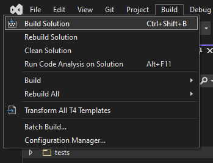
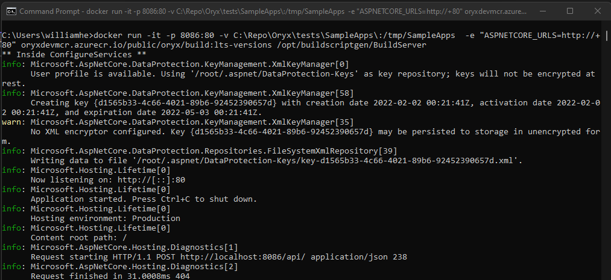
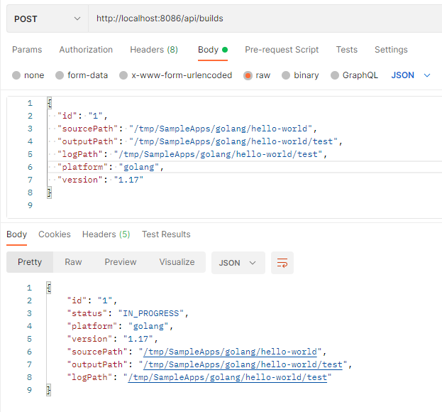
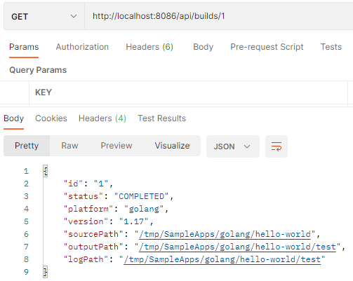
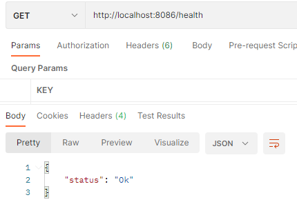

# Oryx

[](https://devdiv.visualstudio.com/DevDiv/_build/latest?definitionId=10393?branchName=master)

Oryx is a build system which automatically compiles source code repos into
runnable artifacts. It is used to build web apps for [Azure App Service][] and
other platforms.

To receive updates on runtimes and versions supported by Oryx and App Service,
subscribe to [Azure Updates][] or watch the
[github.com/Azure/app-service-announcements](https://github.com/Azure/app-service-announcements)
tracker.

[Azure App Service]: https://azure.microsoft.com/services/app-service/
[Azure Updates]: https://azure.microsoft.com/updates

Oryx generates and runs an opinionated build script within a *build* container
based on analysis of a codebase's contents. For example, if `package.json` is
discovered in the repo Oryx includes `npm run build` in the build script; or if
`requirements.txt` is found it includes `pip install -r requirements.txt`.

Oryx also generates a run-time startup script for the app including typical
start commands like  `npm run start` for Node.js or a WSGI module and server
for Python.

The built artifacts and start script are loaded into a minimalistic *run*
container and run.

# Supported platforms and versions

[Link](./doc/supportedPlatformVerions.md)

Patches (0.0.**x**) are applied as soon as possible after they are released upstream.

# Get started

Though built first for use within Azure services, you can also use the Oryx
build system yourself for troubleshooting and tests. Following are simple
instructions; for complete background see our [architecture
doc](./doc/architecture.md).

Oryx includes two command-line applications; the first is included in the
*build* image and generates a build script by analyzing a codebase. The second
is included in *run* images and generates a startup script. Both are aliased
and accessible as `oryx` in their respective images.

### `oryx build`

When `oryx build` is run, the system detects which programming platforms appear
to be in use and applies toolsets appropriate for each one. You can override
the default choices through [configuration](./doc/configuration.md#oryx-configuration).

The `--output` (or `-o`)  parameter specifies where prepared artifacts will be
placed; if not specified the source directory is used for output as well.

For all options, specify `oryx --help`.

### `oryx create-script -appPath`

When `oryx` is run in the runtime images it generates a start script named
run.sh, by default in the same folder as the compiled artifact.

## Support for Build Configuration File

You can provide some extra build related information in an appsvc.yaml in your content
root directory. The build configuration supports 2 sections
1. pre-build
2. post-build

This is how a sample appsvc.yaml looks like

```bash
version: 1

pre-build: | 
    apt install curl
  
post-build: | 
    python manage.py makemigrations 
    python manage.py migrate
```

Oryx will read the yaml and run the commands provided for pre-build and post-build.


## Build and run an app

To build and run an app from a repo, follow these approximate steps. An example
script follows.

1. Mount the repo as a volume in Oryx's `docker.io/oryxprod/build` container.
1. Run `oryx build ...` within the repo directory to build a runnable artifact.
1. Mount the output directory from build in an appropriate Oryx "run"
   container, such as `docker.io/oryxprod/node-10.14`.
1. Run `oryx ...` within the "run" container to write a startup script.
1. Run the generated startup script, by default `/run.sh`.

```bash
# Run these from the root of the repo.
# build
docker run --volume $(pwd):/repo \
    'mcr.microsoft.com/oryx/build:latest' \
    oryx build /repo --output /repo

# run

# the -p/--publish and -e/--env flags specify and open a host port
docker run --detach --rm \
    --volume $(pwd):/app \
    --env PORT=8080 \
    --publish 8080:8080 \
    'mcr.microsoft.com/oryx/node:10' \
    sh -c 'oryx create-script -appPath /app && /run.sh'
```

## Build Server Invocation
1. Build the Oryx solution
    1. 
1. Create image with oryx and platform binaries
    1. `time build/buildBuildImages.sh -t ltsversion`
1. Run docker to port map, volume mount a directory, specify the image with `oryx build`, and invoke BuildServer 
    1. ```bash
        docker run -it -p 8086:80 \
        -v C:\Repo\Oryx\tests\SampleApps\:/tmp/SampleApps \
        -e "ASPNETCORE_URLS=http://+80" \
        oryxdevmcr.azurecr.io/public/oryx/build:lts-versions \
        /opt/buildscriptgen/BuildServer
        ``` 
        
1. Invoke build
    1.  
        1. Under the hood `oryx build` is invoked
            ```bash
            oryx build [sourcePath] \
                --platform [platform] \
                --platform-version [version] \
                --output [outputPath] \
                --log-file [logPath]
            ```
1. Check build status with id `1`
    1. 
1. Check server healthcheck
    1. 

# Components

Oryx consists of a build image, a collection of runtime images, a build script generator, and a collection of
startup script generators. For more details, refer to our [architecture](./doc/architecture.md) page.

# Testing Locally
## startup script generator
`build/testStartupScriptGenerators.sh` will perform tests on all startup script generators written in go. 
The tests are copied into a docker image for performing `go test` on all platforms.

# Contributing

See [CONTRIBUTING.md](./CONTRIBUTING.md).

# License

MIT, see [LICENSE.md](./LICENSE.md).

# Security

Security issues and bugs should be reported privately, via email, to the
Microsoft Security Response Center (MSRC) at
[secure@microsoft.com](mailto:secure@microsoft.com). You should receive a
response within 24 hours. If for some reason you do not, please follow up via
email to ensure we received your original message. Further information,
including the [MSRC
PGP](https://technet.microsoft.com/en-us/security/dn606155) key, can be found
in the [Security
TechCenter](https://technet.microsoft.com/en-us/security/default).

# Data/Telemetry

When utilized within Azure services, this project collects usage data and
sends it to Microsoft to help improve our products and services. Read
[Microsoft's privacy statement][] to learn more.

[Microsoft's privacy statement]: http://go.microsoft.com/fwlink/?LinkId=521839

This project follows the [Microsoft Open Source Code of Conduct][coc]. For
more information see the [Code of Conduct FAQ][cocfaq]. Contact
[opencode@microsoft.com][cocmail] with questions and comments.

[coc]: https://opensource.microsoft.com/codeofconduct/
[cocfaq]: https://opensource.microsoft.com/codeofconduct/faq/
[cocmail]: mailto:opencode@microsoft.com

## Disable Data Collection

To prevent Oryx command line tools from collecting any data, set the environment variable 
`ORYX_DISABLE_TELEMETRY` to `true`.
